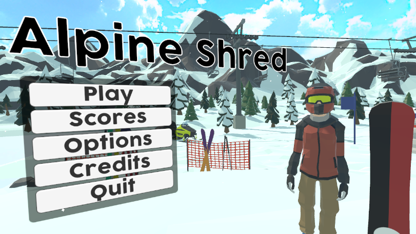
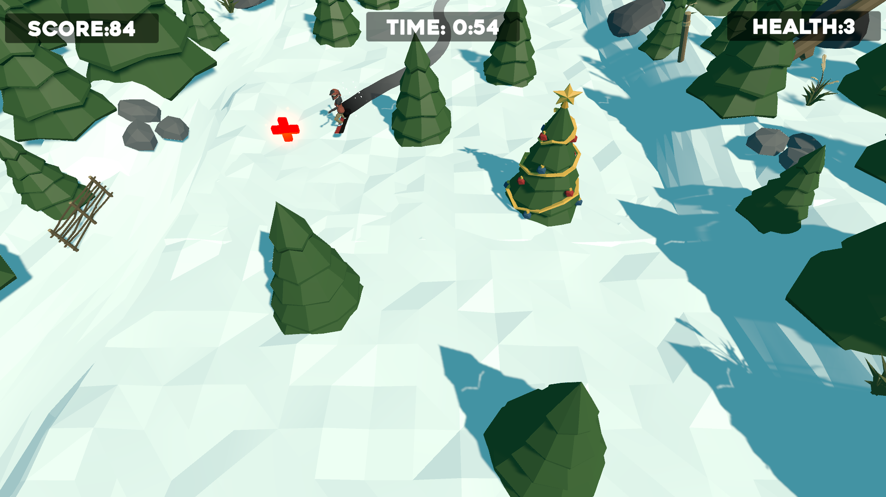

# AlpineShred

An arcade game about snowboarding down a snowy mountain. Made in Unity. This project has had paid assets removed.

## Play Now

Game is available to download and play for free on Windows, Mac, and Linux at https://dispixel.itch.io/alpine-shred

  
  

## Features

### Infinite Runner

Test your reflexes as you snowboard down the mountain at increasingly fast speeds and dense forests. Watch out for obstacles and try to collect as many stars as you can!

### Online Leaderboards

Go head to head with people around the world to see who can rack up the highest score!

## Dependencies
This project depends on the following paid assets:

- [Easy Save 3](https://assetstore.unity.com/packages/tools/utilities/easy-save-the-complete-save-data-serializer-system-768)
- [Fantasy Skybox FREE](https://assetstore.unity.com/packages/2d/textures-materials/sky/fantasy-skybox-free-18353)
- [PolygonParticleFX](https://assetstore.unity.com/packages/vfx/particles/polygon-particle-fx-low-poly-3d-art-by-synty-168372)
- [PolygonSnow](https://assetstore.unity.com/packages/3d/characters/polygon-snow-kit-low-poly-3d-art-by-synty-134501)
- [PolygonVikings](https://assetstore.unity.com/packages/3d/environments/fantasy/polygon-vikings-low-poly-3d-art-by-synty-85664)
- [PolygonXmas](https://syntystore.com/products/polygon-xmas-pack?_pos=1&_sid=5b5567561&_ss=r)
- [PolygonXmas](himom.com)

Also requires Unity Gaming Services package for online leaderboards. Currently experimental and must be downloaded from UGS dashboard.

[1]: https://assetstore.unity.com/packages/tools/utilities/easy-save-the-complete-save-data-serializer-system-768

